```{r setup, include=FALSE}
knitr::opts_chunk$set(echo = TRUE)

```

```{r css, echo=FALSE}
colorize <- function(x, color) {
  if (knitr::is_latex_output()) {
    sprintf("\\textcolor{%s}{%s}", color, x)
  } else if (knitr::is_html_output()) {
    sprintf("<span style='color: %s;'>%s</span>", color,
      x)
  } else x
}
```

# Introduction to Hypothesis Testing

- A single null hypothesis H0: the expected blood pressures of mice in the control and treatment groups are the same.

- Multiple hypothesis testitng (testing $m$ null hypotheses)
$H_{01}$, ..., $H_{0m}$, where e.g. $H_{0j}$ : the expected values of the $j^{th}$ biomarker among mice in the control and treatment groups are equal.

- Hypothesis tests allow us to answer simple **"yes-or-no"** questions such as:
  - $H_0$: there is no difference between A and B
  - $H_a$: there is a difference between A and B

## Hypothesis Testing Steps

1. Define the Null and Alternative Hypotheses
2. Construct the Test Statistic
3. Compute the p-Value
1. Decide Whether to Reject the Null Hypothesis

### Step 1: Define the Null and Alternative Hypotheses

- `r colorize ("Null hypothesis($H_0$):", "olive")` default state of belief about the world

  $H_0$: The coefficient $β_j$ in a linear regression of $Y$ onto $X_1,...,X_p$ equals **zero**.

  $H_0$: There is **no difference** between the mean blood pressure of mice in the control and treatment groups.

- `r colorize ("Alternative hypothesies($H_a$):", "olive")` something different and unexpected

  $H_a$: The coefficient $β_j$ in a linear regression of $Y$ onto $X_1,...,X_p$ equals **not zero**.

  $H_a$: There is **a difference** between the mean blood pressure of mice in the control and treatment groups.


*Note*.The treatment of $H_0$ and $H_a$ is **asymmetric**. 

1. $H_0$ is treated as the default state of the world, and we focus on using data to reject $H_0$. If we reject $H_0$, then this provides evidence in favor of Ha. We can think of rejecting $H_0$ as making a discovery about our data: namely, we are discovering that $H_0$ does not hold!

2. If we fail to reject $H_0$, then our findings are more nebulous: we will not know whether we failed to reject $H_0$ because our sample size was too small (in which case testing $H_0$ again on a larger or higher-quality dataset might lead to rejection), or whether we failed to reject $H_0$ because $H_0$ really holds.


### Step 2: Construct the Test Statistic

`r colorize("Test statistics ($T$):", "olive")` summarizes the extent to which our data are consistent with $H_0$.

For instance, let $x^t_1,...,x^t_{nt}$ denote the blood pressure measurements for the $n_t$ mice in the treatment group, and let $x^c_1,...,x^c_{nc}$ denote the blood pressure measurements for the $n_c$ mice in the control group, and $μ_t = E(X^t), μ_c = E(X^c)$

To test $H_0 : μ_t = μ_c$, we make use of a **two-sample t-statistic**, defined as:

$$T = \frac{\hat{\mu_t} − \hat{\mu_c}}{s\sqrt{\frac{1}{n_t} + \frac{1}{n_c}}}$$

A large (absolute) value of T provides evidence **against** $H_0 : μ_t = μ_c$, and hence evidence in support of $H_a : μ_t \neq μ_c$.

### Step 3: Compute the p-Value

How large statistic is considered large?

`r colorize("p-value:", "olive")` probability of observing a test statistic at least as extreme as the observed statistic, **under the assumption that $H_0$ is true**.

- p-value transforms our test statistic into a number between 0 and 1 (easily interpreted).

- A small p-value provides evidence against $H_0$.

- Given that $T =2.33$, what is the probability of having observed such a large value of T , if indeed $H_0$ holds?

$$H_0 : μ_t = μ_c$$

```{r densityDist, echo=FALSE, fig.align="center", out.height="60%", out.width = "60%", fig.cap="The density function for the N (0, 1) distribution, with the vertical line indicating a value of 2.33"}

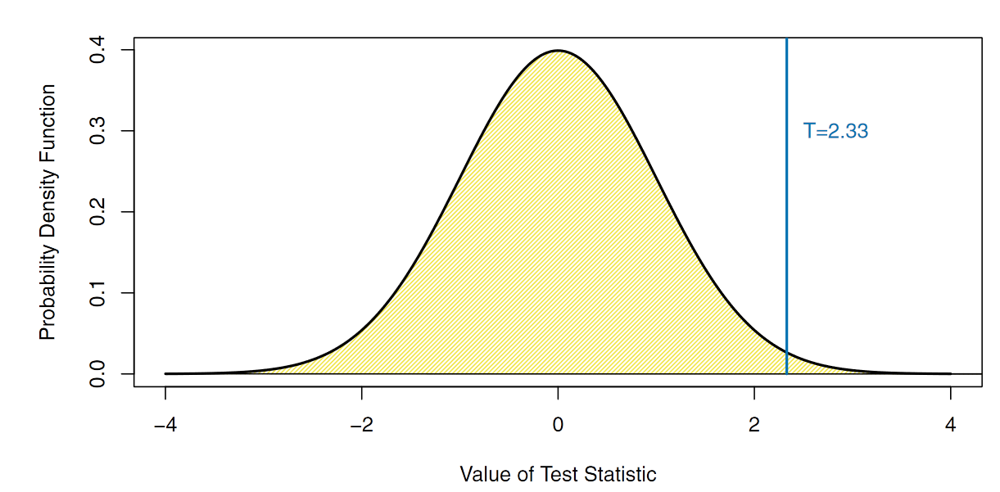

```


1% of the area under the curve falls to the right of the vertical line, so there is only a 2% chance of observing a N (0, 1) value that is greater than 2.33 or less than −2.33. Therefore, if a test statistic has a N (0, 1) null distribution, then an observed test statistic of T =2.33 leads to a p-value of 0.02.

In other words, a 0.02 p-value means, if $H_0$ is true, we would only see |T| this large 2% of the time.

### Step 4: Decide Whether to Reject the Null Hypothesis

- A small p-value indicates that such a large value of the test statistic is unlikely to occur under $H_0$.So, a small p-value provides **evidence against $H_0$**.

- If the p-value is sufficiently small, then we will want to reject $H_0$ (and, therefore, make a potential discovery.

- In some field, p-value threshold is set at 0.05. If the p-value is below 0.05; this means that, if $H_0$ holds, we would expect to see such a small p-value no more than 5% of the time

- But how small is small enough? To answer this, we need to understand the Type I error.

```{r errors, echo=FALSE, fig.align="center", out.height="60%", out.width = "60%", fig.cap="A summary of the possible scenarios associated with testing the null hypothesis; Taken from https://en.wikipedia.org/wiki/Type_I_and_type_II_errors"}

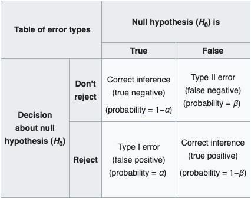

```

#### Type I and Type II Errors

The **Type I error rate** is the probability of making a Type I error given that $H_0$ holds (if we erroneously reject $H_0$ when $H_0$ is in fact true).

The **Type II error rate** is the probability of making a Type II error given that $H_0$ holds (if we do not reject $H_0$ when $H_0$ is in fact false).

The **power** of the hypothesis test is defined as the probability of not making a Type II error given that $H_a$ holds(i.e., the probability of correctly rejecting $H_0$).

```{r errors-II, echo=FALSE, fig.align="center", out.height="60%", out.width = "60%", fig.cap="Relationship between Type I and Type II error; Taken from https://www.scribbr.com/statistics/type-i-and-type-ii-errors/"}

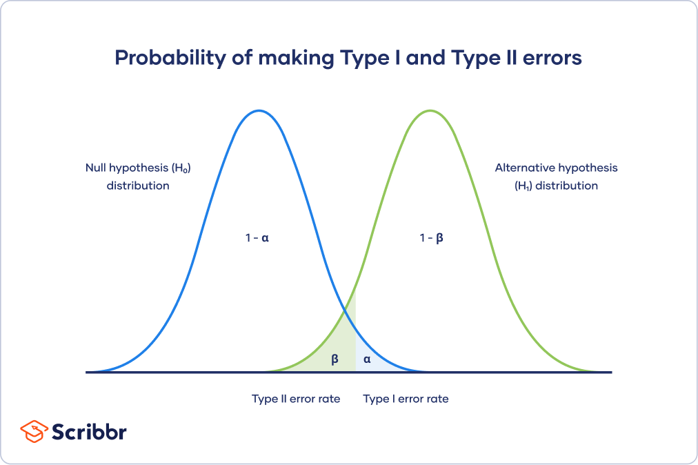

```

*trade-off*: In practice, we typically view Type I errors as more “serious” than Type II errors, because the former involves declaring a scientific finding that is not correct.

We want to ensure a *small* Type I error rate(α =0.05/0.01/0.001).So, we reject $H_0$ when the p-value falls below the α. 

## The Challenge of Multiple Testing

If we wish to test m null hypotheses $H_{01}, ..., H_{0m}$:

- Can we simply reject all null hypotheses for which the corresponding p-value falls below (say) 0:01?

- If we reject all null hypotheses for which the p-value falls below 0:01, then how many Type I errors will we make?

#### The coin analogy

If we flip 1,024 (1,024 = $2^{10}$) fair coins ten times each, we would expect (on average) one coin to come up all tails. 

- There’s a \frac{1}{$2^{10}$} =\frac{1}/{1,024} chance that any single coin will come up all tails. 
- So if we flip 1,024 coins, then we expect one coin to come up all tails, on average.
- The p-value for the null hypothesis that this particular coin is fair is less than 0.002!
  - If the coin is fair, then the probability of observing at least ten tails is $\frac{1}{2}^{10} = \frac{1}{1,024} < 0.001.$ The p-value is therefore 2/1,024 < 0.002, since this is the probability of observing ten heads or ten tails
- So we would conclude it is not fair (i.e. we reject $H_0$, even though it's a fair coin).

This means, if we test a lot of hypotheses, we are almost certain to get one very small p-value by chance!

If we make a decision about whether to reject each null hypothesis without accounting for the fact that we have performed a very large number of tests, then we may end up rejecting a great number of true null hypotheses — that is, making a **large number of Type I errors (false positives)**.

For example, suppose we test $H_{01}, ..., H_{0m}$, all of which are true, and reject any null hypothesis with a p-value below 0.01.

- Then we expect to falsely reject approximately $0.01 \times m$null hypotheses.
- If $m = 10,000$, then we expect to falsely reject $100$ null hypotheses by chance!

## The Family-Wise Error Rate

`r colorize("Family-wise error rate (FWER): ", "olive")`probability of making at least one Type I error when conducting *m* hypothesis tests.


```{r fwer, echo=FALSE, fig.align="center", out.height="60%", out.width = "80%", fig.cap="A summary of the results of testing m null hypotheses"}

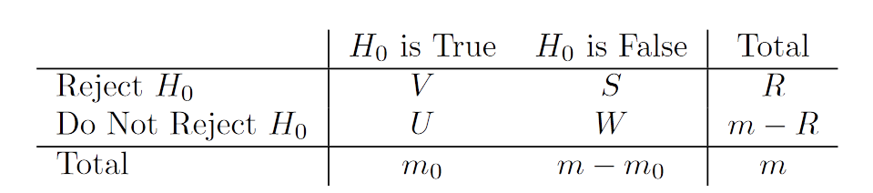

```

- A given null hypothesis is either true or false, and a test of that null hypothesis can either reject or fail to reject it. 
  - V represents the number of Type I errors (also known as false positives or false discoveries)
  - S the number of true positives
  - U the number of true negatives
  - W the number of Type II errors (also known as false negatives).

- In practice, the individual values of V , S, U , and W are unknown. 

- However, we do have access to V + S = R and U + W = m − R, which are the numbers of null hypotheses rejected and not rejected, respectively.

\begin{eqnarray}
FWER(\alpha) &=& 1 - \mathrm{Pr}(V = 0) \\
&=& 1 - \mathrm{Pr}(\text{do not falsely reject any null hypotheses}) \\
&=& 1 - \mathrm{Pr}(\cap^m_{j=1}\left\{ \text{do not falsely reject } H_{0j} \right\}) \\

\text{We assume that the m tests are independent and that all m null hypotheses are true, then} \\

&=& 1 - \prod_{j=1}^{m}(1 - \alpha) \\
&=& 1 - (1- \alpha)^m
\end{eqnarray}

```{r fwer02, echo=FALSE, fig.align="center", out.height="60%", out.width = "80%", fig.cap="The family-wise error rate, as a function of the number of hypotheses tested (displayed on the log scale)"}

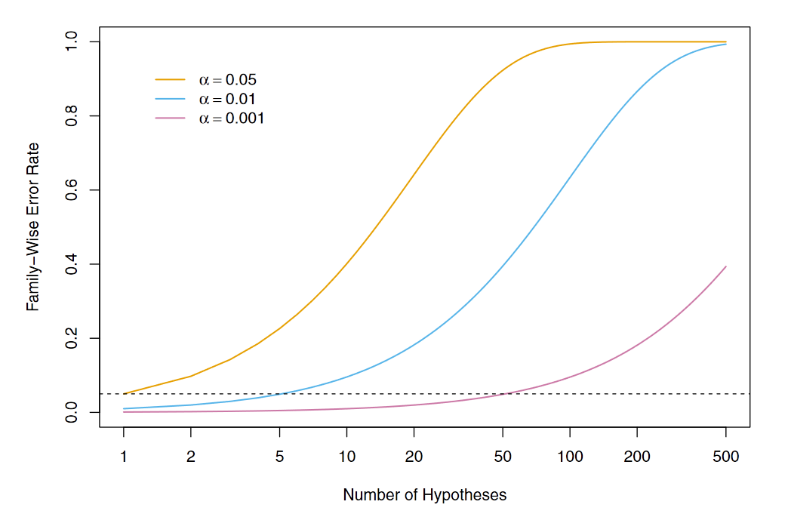

```

*We see that setting α =0.05 results in a high FWER even for moderate m. With α =0.01, we can test no more than five null hypotheses before the FWER exceeds 0.05.*


1. If we test only one null hypothesis, then $FWER(α)= 1 − (1 − α)^1 = α$, so the Type I error rate and the FWER are equal. 

1. However, if we perform $m = 100$ independent tests, then $FWER(α)= 1 − (1 − α)^{100}$. 

1. For instance, taking $α =0.05$ leads to a $FWER \text{ of } 1 − (1 − 0.05)^{100} =0.994$. 

1. In other words, we are virtually **guaranteed** to make at least one Type I error!

### Approaches to Control the Family-Wise Error Rate

- The Bonferroni Method
- Holm’s Step-Down Procedure
- Tukey’s Method and Scheff ́e’s Method

#### The Bonferroni Method

\begin{eqnarray}
FWER &=& Pr (\text{falsely reject at least one null hypothesis}) \\
&=& Pr(\cup_{j=1}^{m} A_j) \\
&\le& \sum_{j=1}^{m} Pr(A_j)
\end{eqnarray}

where $A_j$ is the event that we falsely reject the $j$th null hypothesis

- If we only reject hypothesis when the p-value is less than $\alpha / m$, then 

\begin{eqnarray}
FWER \le \sum_{j=1}^{m} Pr(A_j) \le \sum_{j=1}^{m}\frac{\alpha}{m} = m \times \frac{\alpha}{m} = \alpha
\end{eqnarray}

  because $Pr(A_j) \le \alpha/m$
  
- This is the Bonferroni Correction: to control FWER at level α, reject any null hypothesis with p-value below α/m.

```{r fwer-example, echo=FALSE, fig.align="center", out.height="80%", out.width = "80%", fig.cap="Fund Dataset"}

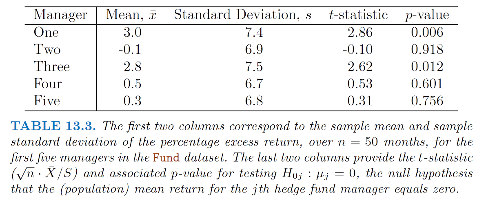

```

**Example:**

- $H_{0j}$ : the $j$th manager's expected excess return equals zero.

- If we reject $H_{0j}$, if the p-value is less than α = 0.05, then we will conclude that the **first** and **third** managers have significantly non-zero excess returns.

- However, we have tested multiple hypotheses, so the FWER is greater than 0.05.

- Using a Bonferroni correction, we reject for p-values less than α/m = 0.05/5 = 0.01.

- Consequently, we will reject the null hypothesis only for the **first** manager.

#### Holm’s Step-Down Procedure (aka Holm-Bonferroni method)

Holm’s method controls the FWER, but it is less conservative than Bonferroni, in the sense that it will reject more null hypotheses, typically resulting in **fewer Type II errors** and hence **greater power**.

- In Holm’s procedure, the threshold that we use to reject each null hypothesis — p(L) in Step 5 — actually depends on the values of all m of the p-values.

- Holm’s method makes no independence assumptions about the m hypothesis tests, and is uniformly more powerful than the Bonferroni method — it will always reject at least as many null hypotheses as Bonferroni.

- **Holm's method controls the FWER at level α**(0.05).

```{r holm-bon, echo=FALSE, fig.align="center", out.height="80%", out.width = "80%", fig.cap="Steps of Holm-Bonferroni method"}

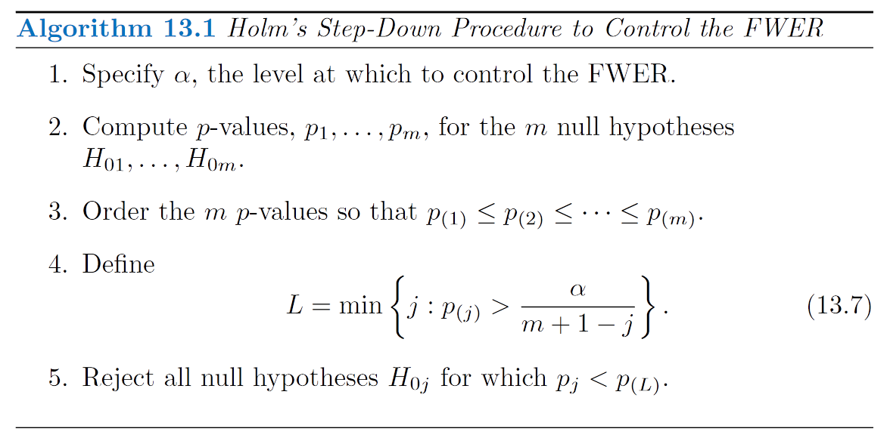

```

**Example:**

```{r fwer-example2, echo=FALSE, fig.align="center", out.height="80%", out.width = "80%", fig.cap="Fund Dataset"}


```

The ordered p-values are $$p_{(1)} = 0.006,$$ $$p_{(2)} = 0.012,$$ $$p_{(3)} = 0.601,$$ $$p_{(4}) = 0.756$$ $$p_{(5)} =0.918$$.

The Holm procedure rejects the first two null hypotheses:

$$p_{(1)} =0.006 < 0.05/(5 + 1 − 1) = 0.01$$

$$p_{(2)} = 0.012 < 0.05/(5 + 1 − 2) = 0.0125$$

$$p_{(3)} = 0.601 > 0.05/(5 + 1 − 3) = 0.167$$

This implies that L = 3, and we reject the null hypotheses for the **first** and **third** managers.

```{r holm-bon2, echo=FALSE, fig.align="center", out.height="80%", out.width = "80%", fig.cap="An illustration of the Bonferroni and Holm methods on three simulated data sets in a setting involving m = 10"}

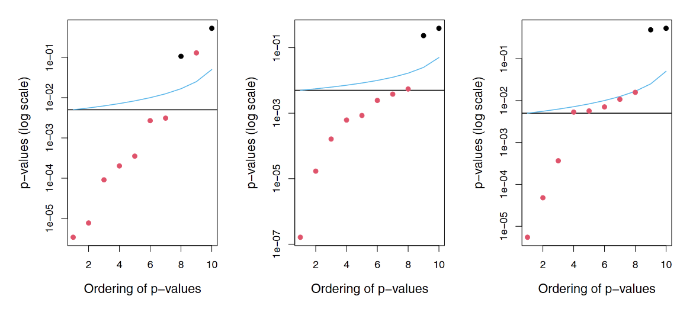

```

Each panel displays the ten corresponding p-values, ordered from smallest to largest, and plotted on a log scale. The eight red points represent the false null hypotheses, and the two black points represent the true null hypotheses. 

- We wish to control the FWER at level 0.05.

- p-values below the black horizontal line are rejected by Bonferroni.

- p-values below the blue line are rejected by Holm.

- The blue line always lies above the black line, so Holm will always reject more tests than Bonferroni; the region between the two lines corresponds to the hypotheses that are only rejected by Holm. 

- In the left-hand panel, both Bonferroni and Holm successfully reject seven of the eight false null hypotheses. 

- In the center panel, Holm successfully rejects all eight of the false null hypotheses, while Bonferroni fails to reject one. 

- In the right-hand panel, Bonferroni only rejects three of the false null hypotheses, while Holm rejects all eight. Neither Bonferroni nor Holm makes any Type I errors in these examples.

- **Conclusion**: Holm and Bonferroni make the same conclusion on the black points, but only Holm rejects for the red point.

Takeway point: 

1. Bonferroni is simple ... reject any null hypothesis with a p-value below α/m.

1. Holm is slightly more complicated, but it will lead to more rejections while controlling FWER!!

1. So, **Holm is a better choice!**

#### Tukey’s Method 

$$μ_1 = μ_2 = μ_3 = μ_4 = μ_5 \neq μ_6$$

- **Tukey's Method**: for pairwise comparisons of the difference in expected means among a number of groups.

  - when performing m = G(G − 1)/2 pairwise comparisons of G means, it allows us to control the FWER at level α while rejecting all null hypotheses for which the p-value falls below $α_T$ , for some $α_T$ > α/m.
  - G = 6 means
  - m = G(G − 1)/2 = 15 null hypotheses
  
```{r tukey1, echo=FALSE, fig.align="center", out.height="80%", out.width = "80%", fig.cap="Tukey’s method on three simulated data sets in a setting with G = 6 means"}

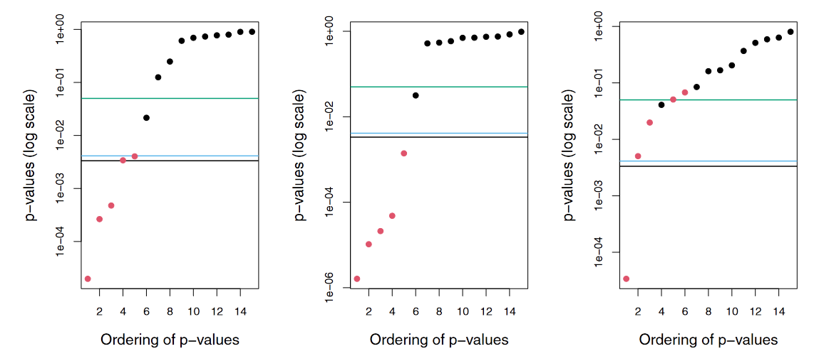

```

- In each panel, the true null hypotheses are displayed in black, and the false ones are in red. 

- When controlling the FWER at level 0.05, the Bonferroni procedure rejects all null hypotheses that fall below the black line, whereas Tukey rejects all those that fall below the blue line.

- Controlling the Type I error without adjusting for multiple testing involves rejecting all those that fall below the green line.

- The horizontal lines indicate that Tukey’s method always results in at least as many rejections as Bonferroni’s method. 

- In the left-hand panel, Tukey correctly rejects two more null hypotheses than Bonferroni.

- **Thus, Tukey’s method has slightly higher power than Bonferroni’s method.**

#### Scheffe’s Method

- **Scheffe’s Method**: for testing arbitrary linear combinations of a set of expected means, e.g

$$H_0 : \frac{1}{2}(\mu_1 + \mu_3) = \frac{1}{3}(\mu_2 + \mu_4 + \mu_5)$$

  - It allows us to compute a value $α_S$ such that rejecting the null hypothesis H0 in (13.8) if the p-value is below $α_S$ will control the Type I error at level α.
  - For example, in order to control the Type I error at level α =0.05, we must set $α_S$ =0.002.
  - Our calculation using a variant of two-sample t-test resulted in p-value of 0.004. 
  - Therefore, we are unable to reject $H_0$ above, despite the apparently very small p-value of 0.004.
  - Advantage of Scheffe’s method: we can use the same threshold of $α_S$ = 0.002 repeatedly to perform a pairwise comparison of any split of the managers into two groups.


#### Takeway point:
- Bonferroni and Holm are general procedures that will work in most settings. 
- However, in certain special cases, methods such as Tukey and Scheffe can give better results:i.e. **more rejections while maintaining FWER control**.

## False Discovery Rate

Power is defined as the number of false null hypotheses that we reject divided by the total number of false null hypotheses, i.e. $S/(m − m_0)$ 

  
```{r power-m, echo=FALSE, fig.align="center", out.height="80%", out.width = "80%", fig.cap="An Illustration of Trade-Off Between the FWER and Power"}

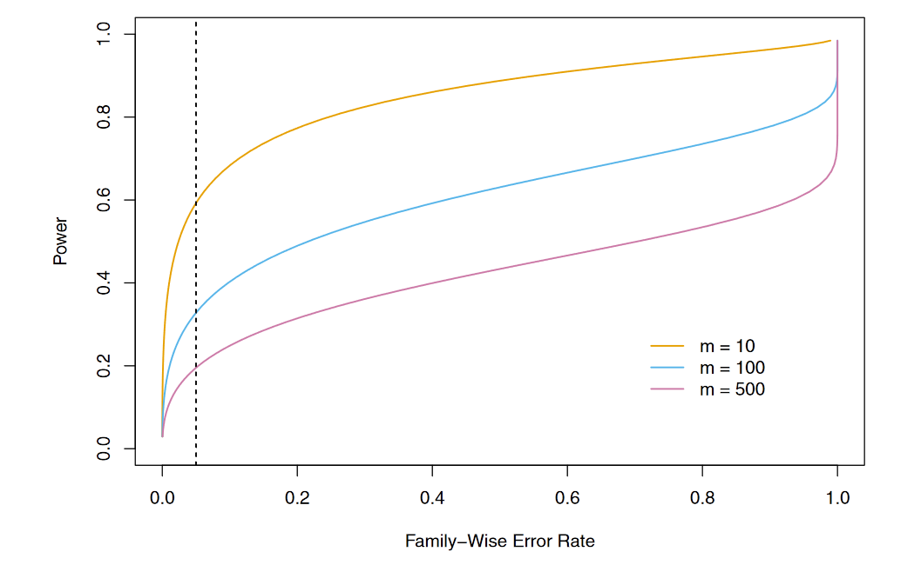

```

#### Takeway point:
- As the value of m increases, the power decreases.
- The vertical dashed line indicates a FWER of 0.05.

```{r fwer03, echo=FALSE, fig.align="center", out.height="60%", out.width = "80%", fig.cap="A summary of the results of testing m null hypotheses"}


```

- The FWER rate focuses on controlling Pr(V > 1), i.e., the probability of falsely rejecting any null hypothesis.

- This is a tough ask when m is large! It will cause us to be super conservative (i.e. to very rarely reject).

- In practice, when m is large, we may be willing to tolerate a few false positives, in the interest of making more discoveries, i.e. more rejections of the null hypothesis.

- We can ensure that the ratio of false positives (V) to total positives (V + S = R) is sufficiently low 

$$\text{False discovery proportion (FDP)} = \frac{V}{R}$$

- In practice, controlling the FDP is an impossible task as we have no way to be certain which hypotheses are true and which are false.

- Instead, we can control the false discovery rate:

$$FDR = E(FDP) = E(\frac{V}{R})$$
- For example, when we control the FDR at (say) level q = 20%, we are **rejecting as many null hypotheses as possible** while guaranteeing that **no more than 20% of those rejected null hypotheses are false positives**, on average.

$$\text{False discovery rate (FDR)} = E\left(\frac{V}{R}  \right) = E\left( \frac{\text{number of false rejections}}{total number of rejections} \right)$$


#### Example (Exploratory analysis):

- A scientist conducts a hypothesis test on each of m = 20,000 drug candidates.

- She wants to identify a smaller set of promising candidates to investigate further.

- She wants reassurance that this smaller set is really "promising", i.e. not too many falsely rejected $H_0$'s.

- FWER controls Pr(at least one false rejection).So, we would expect 1,000 drugs to have such small p-values simply by chance(0.05 × 20,000 = 1,000).

- FDR controls the fraction of candidates in the smaller set that are really false rejections. This is what she needs!

**Main takeway:** 
1. When m is large, controlling the FWER is simply too stringent, and will not lead to “enough” discoveries.

1. Unlike p-values, there is no standard accepted threshold for FDR control. Instead, the choice of FDR threshold is typically context-dependent, or even datasetdependent.


#### Benjamini-Hochberg Procedure

The **Benjamini-Hochberg** procedure gives us a very easy way to determine, given a set of m p-values, which null hypotheses to reject in order to control the FDR at any **pre-specified level q.**

```{r Ben-hoch1, echo=FALSE, fig.align="center", out.height="60%", out.width = "80%", fig.cap="The Benjamini-Hochberg Procedure"}

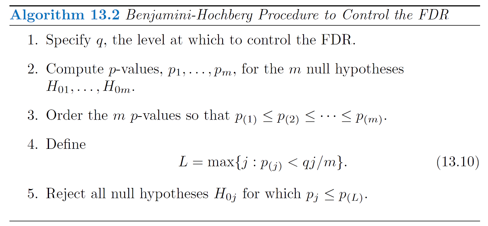

```

**Example using the Fund Dataset**

$$p_{(1)} =0.006 < 0.05 × 1/5$$ 
$$p_{(2)} =0.012 < 0.05 × 2/5$$
$$p_{(3)} =0.601 > 0.05 × 3/5$$
$$p_{(4)} =0.756 > 0.05 × 4/5$$
$$p_{(5)} =0.918 > 0.05 × 5/5$$

- To control the FDR at 5%, we reject the null hypotheses that the **first** and **third** fund managers perform no better than chance.


As long as the mp-values are independent or only mildly dependent, then the Benjamini-Hochberg procedure guarantees 
$$FDR \le q$$

In other words, this procedure ensures that, on average, no more than a fraction q of the rejected null hypotheses are false positives.

The Benjamini-Hochberg procedure is more complicated: we reject all null hypotheses for which the **p-value is less than or equal to the Lth smallest p-value**, where L is itself a function of all m p-values

**Multiple null hypotheses, m =2,000 ordered p-values for the Fund data**

```{r Ben-hoch2, echo=FALSE, fig.align="center", out.height="60%", out.width = "80%", fig.cap="The results of applying the Bonferroni and BenjaminiHochberg procedures on the Fund data set"}

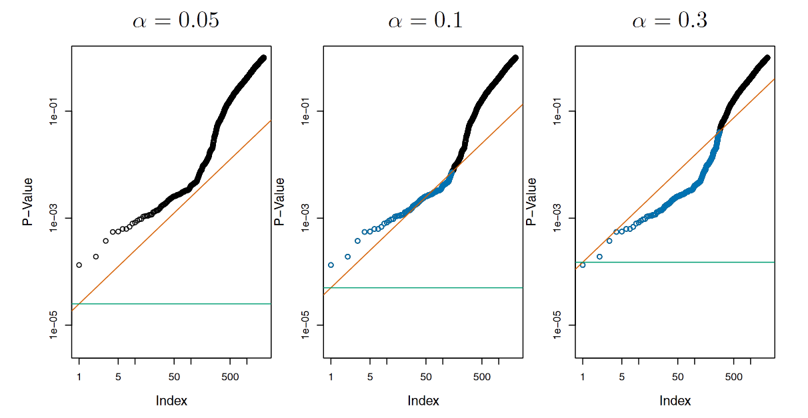

```

- The green lines indicate the p-value thresholds corresponding to FWER control, via the Bonferroni procedure, at levels α = 0.05 (left), α = 0.1 (center), and α = 0.3 (right).

- The orange lines indicate the p-value thresholds corresponding to FDR control, via Benjamini-Hochberg, at levels q = 0.05 (left), q = 0.1 (center), and q = 0.3 (right).

- When the FDR is controlled at level q = 0.1, 146 null hypotheses are rejected (center); the corresponding p-values are shown in blue. 

- When the FDR is controlled at level q =0.3, 279 null hypotheses are rejected (right); the corresponding p-values are shown in blue.


# A Re-Sampling Approach to p-Values and False Discovery Rates

So far, we have assumed that we want to test some null hypothesis $H_0$ with some test statistic T, and that we know
(or can assume) the distribution of T under $H_0$.

`r colorize("Theoretical null distribution: ", "olive")`Distribution under $H_0$ is known. 

What if this theoretical null distribution is **unknown** (or null hypothesis $H_0$ or test statistic $T$ is somewhat unusual and some assumption that is required for it to hold is violated)?

## A Re-Sampling Approach to the p-Value

- Suppose we want to test $H_0$ : $E(X) = E(Y)$ versus $H_a$ : $E(X) \neq E(Y)$, using $n_X$ independent observations from $X$ and $n_Y$ independent observations from $Y$. 

- The two-sample t-statistic takes the form

$$T = \frac{\widehat{\mu}_X - \widehat{\mu}_Y}{s\sqrt[]{1/n_X + 1/n_Y}}$$
$$\text{(13.11)A large (absolute) value of T provides evidence against } H_0$$

- If  $n_X$ and $n_Y$ are large, then $T$ approximately follows a $N(0, 1)$ distribution under $H_0$. 

- If  $n_X$ and $n_Y$ are small, then we don't know the theoretical null distribution of $T$.

- Let's take a permutation or re-sampling approach....

```{r resampling2, echo=FALSE, fig.align="center", out.height="80%", out.width = "80%", fig.cap="Re-Sampling p-Value for a Two-Sample t-Test"}

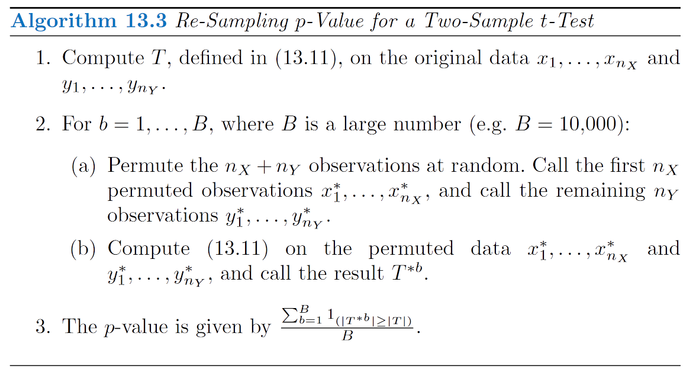

```

1. If $H_0$ holds, so that $E(X)= E(Y )$, and we make the stronger assumption that the distributions of X and Y are the same. 

1. Then the distribution of T is invariant under swapping observations of X with observations of Y . 

1. That is, if we randomly swap some of the observations in X with the observations in Y , then the **test statistic $T$ in (13.11) computed based on this swapped data has the same distribution as $T$ based on the original data**. 

1. This is true only if $H_0$ holds, and the distributions of X and Y are the same.

An approximation of the null distribution of $T$ under $H_0$: 

$$T^{*1}, ..., T^{*B}$$

**p-value for T**

$$p-value = \frac{\sum_{b=1}^{B}1_{(|T^{*b}|\ge |T|)}}{B}$$

**p-value**: the fraction of permuted datasets for which the value of the test statistic is at least as extreme as the value observed on the original data.


#### Example using Khan dataset

Khan dataset, which consists of expression measurements for 2,308 genes in four sub-types of small round blood cell tumors, a type of cancer typically seen in children.

- Two sub-types: rhabdomyosarcoma ($n_X$ = 29) and Burkitt’s lymphoma ($n_Y$ = 25).

- The re-sampling null distribution, and the actual value of the test statistic (T = −2.09)

- Using the theoretical null distribution, which is a $t_{52}$ distribution (since $n_X$ + $n_Y$ − 2 = 52), we obtain a p-value of 0.041.

- If we instead apply Algorithm 13.3 with B = 10,000, then we obtain a p-value of 0.042.

```{r resampling3, echo=FALSE, fig.align="center", out.height="60%", out.width = "80%", fig.cap="Theoretical p-value is 0.041. Re-sampling p-value is 0.042."}

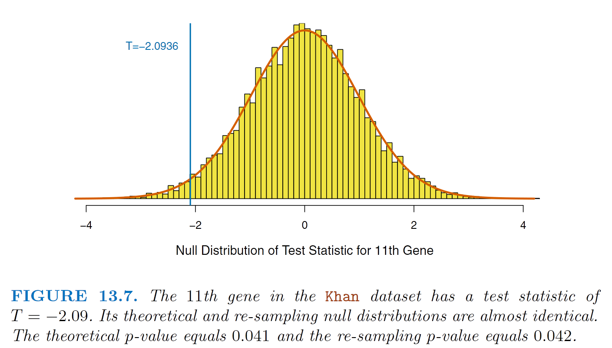

```


- The figure below shows an analogous set of results for the 877th gene. In this case, there is a substantial difference between the theoretical and re-sampling null distributions, which results in a difference between their p-values.


```{r resampling4, echo=FALSE, fig.align="center", out.height="60%", out.width = "80%", fig.cap="Theoretical p-value is 0.571. Re-sampling p-value is 0.673."}


```

Note. In general, in settings with a smaller sample size or a more skewed data distribution (so that the theoretical null distribution is less accurate), **the difference between the re-sampling and theoretical p-values** will tend to be **more pronounced**.

Do note that a single observation in the 877th gene is very far from the other observations, leading to a very *skewed distribution*.

## A Re-Sampling Approach to the False Discovery Rate

Suppose that we wish to control the FDR for m null hypotheses, $H_{01},...,H_{0m}$, in a setting in which either no theoretical null distribution is available, we can: 

1. apply the Benjamini-Hochberg procedure


1. estimate the FDR via re-sampling (without computing p-values)


In order to estimate the FDR via re-sampling, we first make the following approximation:

$$FDR = E\left( \frac{V}{R} \right) ≈ \frac{E(V)}{R}$$
1. We reject any null hypothesis for which the test statistic exceeds c in absolute value.

  $E(V)$ is expected number of false positives associated with rejecting any null hypothesis for which the test statistic exceeds c in absolute value.

1. We simulate data under $H_{01},...,H_{0m}$, and then compute the resulting test statistics. The number of re-sampled test statistics that exceed c provides an estimate of V


```{r algot4, echo=FALSE, fig.align="center", out.height="60%", out.width = "80%", fig.cap="Plug-in estimate of the FDR for a Two-Sample T -Test"}

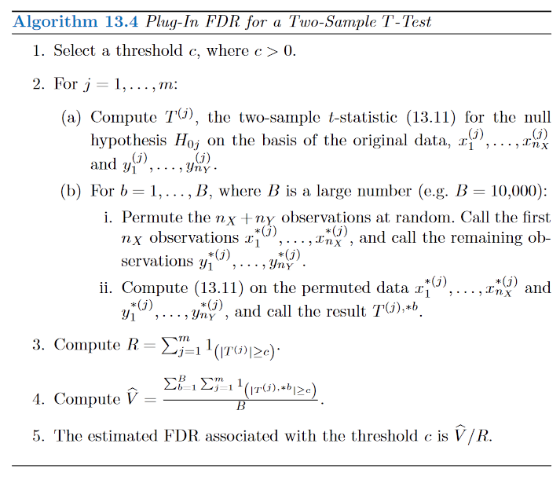

```


```{r figure11, echo=FALSE, fig.align="center", out.height="60%", out.width = "80%", fig.cap="the mean expression in Burkitt’s lymphoma equals the mean expression in rhabdomyosarcoma"}

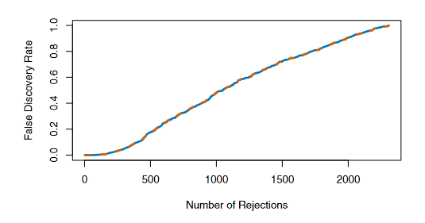

```

- The orange dashed curve shows the FDR obtained using the Benjamini-Hochberg procedure, whereas the blue solid curve shows the FDR obtained using the re-sampling approach of Algorithm 13.4, with B = 10,000. 

- There is very little difference between the two FDR estimates. 

- According to either estimate, rejecting the null hypothesis for the 500 genes with the smallest p-values corresponds to an FDR of around 17.7%.

### When Are Re-Sampling Approaches Useful?


#### Conclusion

- Re-sampling approaches are useful if the theoretical null distribution is unavailable, or requires stringent
assumptions. (So, they're always useful!)

- An extension of the re-sampling approach to compute a p-value can be used to control FDR.


